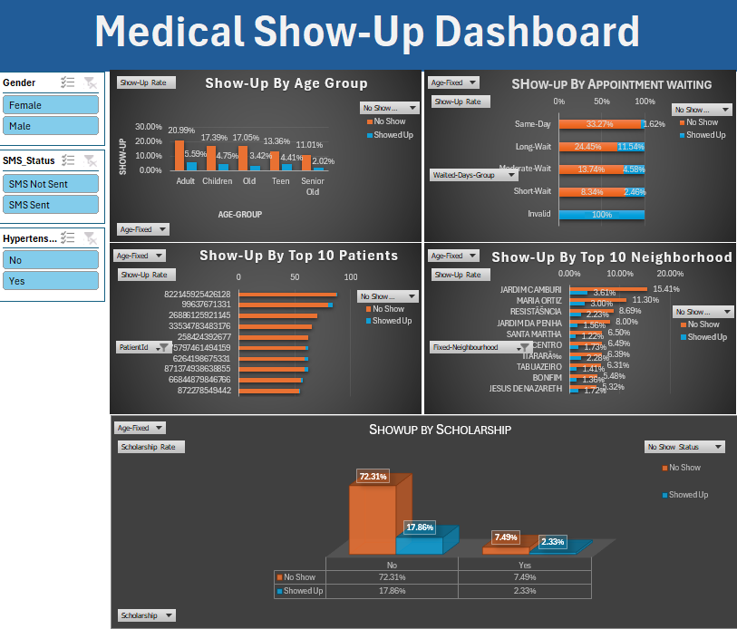

# Medical Appointment No-Shows Analysis (Excel-Based)

This project explores a real-world dataset of over 100,000 medical appointments to understand the factors behind patients missing their scheduled visits. Missed appointments cause inefficiencies and financial losses in healthcare. Using **Microsoft Excel**, this project applies data cleaning, pivot analysis, KPIs, and dashboards to provide actionable insights.

---

## Tools & Technologies Used

- **Microsoft Excel**
  - Data Cleaning (Text to Columns, Date Formatting)
  - Formulas (`IF`, `IFS`, `COUNTIF`, `DATEDIF`, etc.)
  - Pivot Tables
  - Conditional Formatting
  - Data Visualization (Bar Charts, Pie Charts, Line Graphs)
  - Slicers and Filters
  - Dashboard Creation

---

## Dataset

- **Source**: [Kaggle - Medical Appointment No Shows](https://www.kaggle.com/datasets/joniarroba/noshowappointments)
- **Features include**:
  - Patient Demographics: `Age`, `Gender`, `Neighborhood`
  - Appointment Details: `Scheduled Day`, `Appointment Day`
  - Health Conditions: `Diabetes`, `Hypertension`, `Alcoholism`
  - SMS Reminder: `SMS_received`
  - **Target Variable**: `No-show` (Yes/No)

---

## Workflow

### 1. Data Cleaning
- Removed duplicates and invalid records (e.g., negative ages)
- Cleaned `DateTime` formats (removed time component)
- Created new columns:
  - `Days_Waited` = `AppointmentDay - ScheduledDay`

### 2. Exploratory Data Analysis (EDA)
- Used **Pivot Tables** to explore:
  - Show/No-show rates by `Gender`, `Age Group`, `SMS_received`
  - Average waiting time by show status
  - No-show trends by week or region

### 3. Dashboard
- Created an **interactive Excel dashboard** with:
  - Slicers for dynamic filtering
  - KPI cards
  - Visual charts and summaries

## Dashboard Preview

---

## Key Metrics

- **No-show rate without SMS**: ~75%
- **No-show rate with SMS**: ~15%
- **Same-day appointment no-show**: ~49%
- **Long-wait (>5 days) no-show**: ~13.5%
- **Moderate wait (3–5 days) show-up rate**: Highest
- **Scholarship patients no-show rate**: ~79%
- **Top neighborhoods by no-shows**: Jardim Camburi, Maria Ortiz, Resistência

---

## Insights

- Higher no-show rates seen among:
  - Patients with **same-day** or **long waiting periods**
  - Patients who **did not receive SMS reminders**
  - **Adults** and those from certain **neighborhoods**
  - **Scholarship patients** despite financial support

- **SMS reminders** significantly improve attendance

---

### Recommendations

- Send **SMS reminders** consistently  
- Avoid **same-day** or **long-delay** appointments  
- Prioritize **high-risk patients** on mid-week days (e.g., Tuesday/Wednesday)  
- Investigate and address **low-attendance neighborhoods**

---

## Project Goal

To support clinics and hospitals in **reducing appointment no-shows** by:
- Identifying key behavioral and scheduling patterns
- Offering Excel-based dashboards and reports for operational use

---

## Project Status

- Data Cleaning Completed  
- Pivot Table EDA Done  
- Dashboard Created  

---

## Files Included

- `Medical-NoShow-Analysis-Bhaskar.xlsx` – Main Excel file with:
  - Raw & Cleaned Data (separate sheets)
  - Pivot Tables
  - Dashboard Sheet
  - Calculated Fields and KPIs

⚠️ **Note**: Due to limitations in Google Drive's preview, slicers, interactivity, and dashboard visuals may not display correctly online.  
To explore the full dashboard experience, please **download the Excel file** and open it with **Microsoft Excel Desktop**.
🔗 [Download Excel Dashboard from Google Drive](https://docs.google.com/spreadsheets/d/18pEgtIarzOStot1WFO0SweHFv39uYU2t/edit?gid=2044042214#gid=2044042214)

---

##  Author

**Bhaskar Bharati**  
📧 [vaskarv959@gmail.com](mailto:vaskarv959@gmail.com)  
🔗 [LinkedIn: bhaskar-bharati](https://www.linkedin.com/in/bhaskar-bharati/)

---

 **If you found this helpful, consider starring the repo!**
